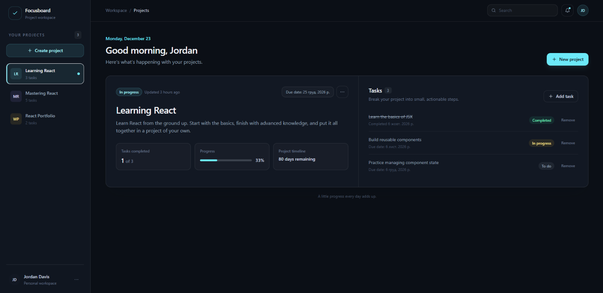
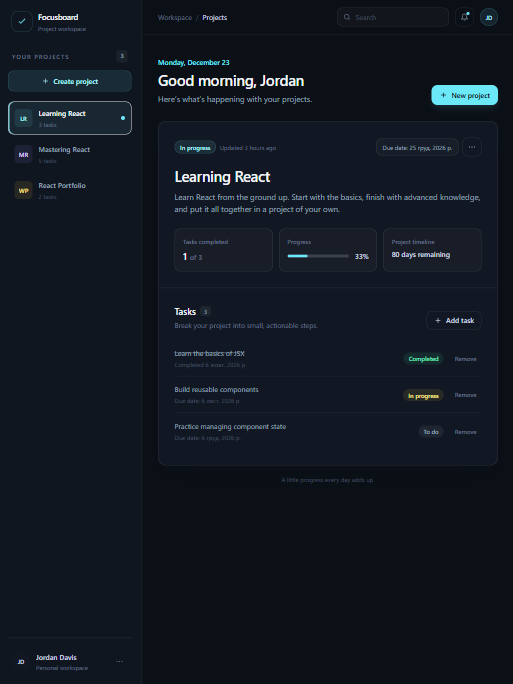
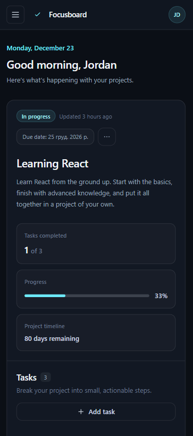

# Project Management

A project management app built with React, TypeScript, Vite, and Tailwind CSS. It includes a project dashboard with project details and metrics, plus task creation, removal, and status updates.

## Screenshots

### Desktop



### Tablet and mobile

| Tablet                                                 | Mobile                                                 |
| ------------------------------------------------------ | ------------------------------------------------------ |
|  |  |

## Prerequisites

- Node.js
- pnpm 12.10.1

## Getting started

Install dependencies and start the development server along with the mock API server:

```sh
pnpm install
pnpm dev
pnpm server
```

Vite prints the local development URL in the terminal.

## Available scripts

| Command             | Description                                        |
| ------------------- | -------------------------------------------------- |
| `pnpm dev`          | Start the Vite development server.                 |
| `pnpm server`       | Start the json-server mock API on port 3000.       |
| `pnpm build`        | Create a production build in `dist/`.              |
| `pnpm preview`      | Preview the production build locally.              |
| `pnpm check:cycles` | Check for circular dependencies in `src/`.         |
| `pnpm lint`         | Check JavaScript and TypeScript files with ESLint. |
| `pnpm lint:fix`     | Run ESLint and apply available automatic fixes.    |
| `pnpm format`       | Format project files with Prettier.                |
| `pnpm format:check` | Check formatting without changing files.           |

## Pre-commit checks

Husky runs the following commands before each commit:

```sh
pnpm lint:fix
pnpm format
```

These commands apply automatic lint fixes and formatting across the project. Review and stage any resulting changes before committing.

## Pre-push checks

Husky runs `pnpm check:cycles` before each push. It uses Madge to check TypeScript and TSX modules in `src/` for circular dependencies. Run the command directly at any time:

```sh
pnpm check:cycles
```

## Import ordering

ESLint enforces import groups in this order, with a blank line between groups:

1. React imports.
2. Other third-party imports.
3. Application imports, including relative paths.

## Project structure

```text
.
├── public/                 # Static assets
├── src/
│   ├── assets/             # Source assets
│   ├── constants/          # Application constants
│   ├── features/           # Feature-based modules (Project, Task management)
│   ├── layout/             # Layout components
│   ├── types/              # TypeScript definitions
│   ├── ui/                 # Reusable UI components
│   ├── utils/              # Helper functions
│   ├── App.tsx             # Root application component
│   ├── index.css           # Global styles
│   └── main.tsx            # Application entry point
├── eslint.config.js        # ESLint flat configuration
├── index.html              # Vite HTML entry
├── package.json
├── pnpm-lock.yaml
├── tailwind.config.js
└── vite.config.js
```
